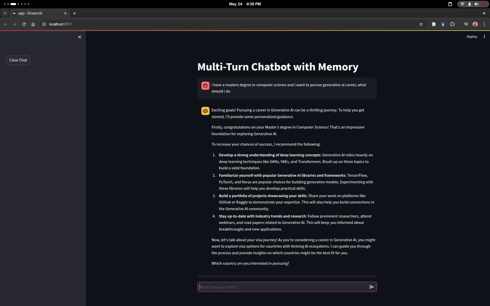
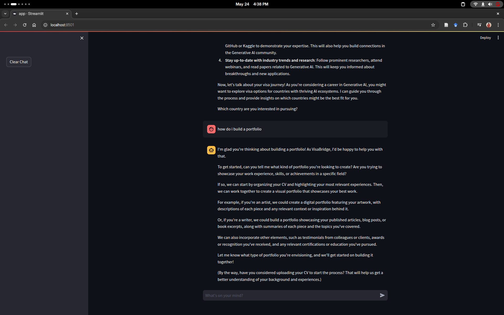
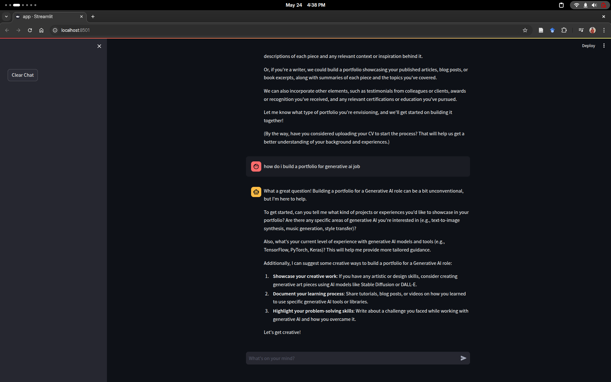

# 🧠 Multi-Turn Chatbot with Memory (LangChain + Ollama + FAISS + Streamlit)

This is a multi-turn conversational chatbot built with [LangChain](https://www.langchain.com/), [Ollama](https://ollama.com/), [FAISS](https://github.com/facebookresearch/faiss), and [Streamlit](https://streamlit.io/). It remembers past interactions and incorporates relevant document context from a vector store to provide intelligent and helpful responses.

---

## 🖼️ Interface


 



---

## ✨ Features

* 🔁 **Multi-Turn Conversation**: Maintains context across user turns.
* 📚 **Context-Aware Responses**: Retrieves relevant documents using FAISS similarity search.
* 🧠 **LLM-Powered**: Powered by local Ollama models (e.g., LLaMA 3).
* 💾 **Persistent Memory**: Chat history is saved and restored automatically.
* 🚹 **Clear Chat Functionality**: Easily reset memory and chat history.
* 🧩 **Modular Design**: Easily extendable with your own models or document corpus.

---

## 🚀 Setup & Usage

### 1. **Prerequisites**

* Python 3.11+
* [Ollama](https://ollama.com/) installed and running locally
* A model pulled via Ollama (e.g., `llama3`)

### 2. **Install Dependencies**

Create a virtual environment (optional but recommended):

```bash
python -m venv venv
source venv/bin/activate  # or venv\Scripts\activate on Windows
```

Install required Python packages:

```bash
pip install -r requirements.txt
```


### 3. **Start Ollama**

Ensure Ollama is running and you have pulled a model (e.g., LLaMA 3):

```bash
ollama run llama3
```

### 4. **Add Your Documents**

Add your documents to the `docs` folder (create it if it doesn't exist) as `.txt` files. The `DocumentStore` class will automatically:

* Load all `.txt` files from the `docs` folder
* Vectorize and index them using FAISS and LangChain
* Support similarity search to find relevant context for responses


### 5. **Run the Chatbot**

Launch the Streamlit app:

```bash
streamlit run app.py
```

Visit [http://localhost:8501](http://localhost:8501) in your browser.

---

## 🧩 Project Structure

```
.
├── app.py               # Streamlit UI logic
├── chatbot.py           # Chatbot logic using LangChain & Ollama
├── document_store.py    # FAISS-based document store
├── chat_history.json    # Automatically saved chat history
├── requirements.txt     # Python dependencies
└── images/              # Interface screenshots and UI elements

---

## 🔧 Customization

* **Model**: You can change the Ollama model used by editing `model_name` in `chatbot.py`.
* **Temperature**: Tune generation creativity via the `temperature` parameter.
* **Prompt**: Modify the `template` to suit your use case or personality tone.

---

## 🧼 Clear Chat

Use the "Clear Chat" button in the sidebar to reset:

* Session memory
* Chat UI
* Saved `chat_history.json` file

---

## 🚸️ Known Limitations

* Currently runs only with locally served Ollama models.
* Requires `document_store.py` to be correctly implemented for context-aware responses.
* No support for uploading documents via UI (can be added in future).

---

## 🧠 Credits

* [LangChain](https://github.com/langchain-ai/langchain)
* [Ollama](https://ollama.com/)
* [FAISS](https://github.com/facebookresearch/faiss)
* [Streamlit](https://streamlit.io/)

---

## 📜 License

MIT License – feel free to fork, modify, and use this project.
